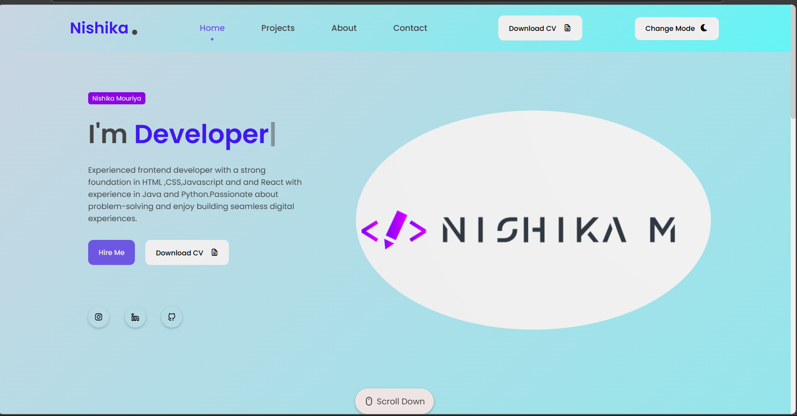
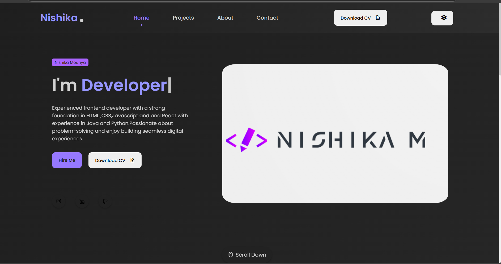

🚀 Responsive Portfolio Website
A modern, fully responsive portfolio website featuring dark mode, a dynamic navigation bar, typing effects, scroll animations, and an interactive user experience.

📌 Features
Responsive Navigation Bar with a mobile-friendly menu.
Dark Mode Toggle (persists user preference using localStorage).
Sticky Navigation Bar with a shadow effect on scroll.
Typing Effect for an interactive heading.
Scroll Reveal Animations to enhance UI/UX.
Active Section Highlighting in the navigation menu.

🛠️ Technologies Used
HTML5, CSS3, JavaScript (ES6+)
Typed.js (Typing Effect)
ScrollReveal.js (Scroll Animations)
FontAwesome (Icons)

📸 Screenshots
🌞 Light Mode

🌙 Dark Mode

This project is open-source and available under the MIT License.

